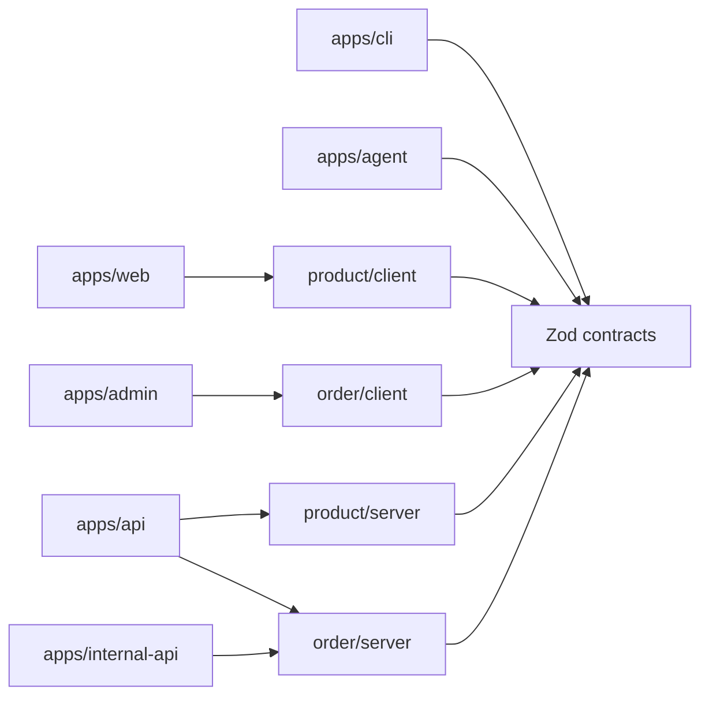

# Stayline

여기어때에서 익숙한 “검색하고, 비교하고, 예약한다”는 흐름을 포트폴리오용 숙박 도메인으로 재해석한 TypeScript 풀스택 모노레포 템플릿입니다. 실제 서비스 콘텐츠를 복제하지 않고, `product`와 `order` 예제로 모듈 경계와 계약 공유를 보여줍니다.

## 무엇을 해결하나

프론트엔드, API, CLI, Agent가 서로 다른 타입을 복사해 갖는 문제를 Zod contract 하나로 줄입니다. 실행 단위는 `apps`, 비즈니스 문맥은 `modules`가 소유하므로 서비스가 커져도 도메인 모듈을 독립적으로 옮길 수 있습니다.



## 구조

`apps/web`은 넓은 여백과 카드 중심의 Product Catalog, `apps/admin`은 밀도 높은 테이블 중심의 Order Operations입니다. 둘은 `packages/ui`의 semantic token과 컴포넌트를 공유하지만 화면 목적은 분리되어 있습니다.

```text
apps/       실행 가능한 web, admin, api, internal-api, cli, agent
modules/    order, product의 contract/server/client/testing
packages/   ui, platform, config, testkit
tooling/    boundary 검사와 module/app generator
docs/       설계 결정과 운영 메모
```

모듈의 public API는 다음 네 가지 subpath로만 사용합니다.

```ts
import { ProductSchema } from '@repo/product/contract';
import { ProductModule } from '@repo/product/server';
import { useProducts } from '@repo/product/client';
import { createProductFixture } from '@repo/product/testing';
```

## 실행

```bash
bun install
bun run dev
```

- Web: `http://localhost:5173`
- Admin: `http://localhost:5174`
- Public API: `http://localhost:3000/api`
- Internal API: `http://localhost:3001/internal-api`

Bun 버전과 workspace 의존성만 Docker로 고정하고 서버는 호스트 Bun 프로세스로 실행하려면 `bun run docker:dev`를 사용합니다. Docker 의존성 준비가 끝난 뒤 호스트에서 `bun dev`가 실행됩니다.

```bash
bun run cli orders:list
bun run cli products:list
bun run agent product:search --query cabin
```

## 검증

```bash
bun run format:check
bun run lint
bun run typecheck
bun run test
bun run test:architecture
bun run build
bun run verify
```

개별 실행 단위는 각각 독립적으로 컨테이너화할 수 있습니다. 자세한 build context, 포트와 healthcheck는 [`docs/containerization.md`](docs/containerization.md)를 참고하세요.

```bash
docker build -f apps/api/Dockerfile -t stayline-api .
docker build -f apps/internal-api/Dockerfile -t stayline-internal-api .
docker build -f apps/web/Dockerfile -t stayline-web .
docker build -f apps/admin/Dockerfile -t stayline-admin .
```

배포 이미지와 동일한 결과를 로컬에서 확인하려면 Docker Compose로 전체 스택을 실행할 수 있습니다.

```bash
bun run docker:local
```

Web은 `http://localhost:5173`, Admin은 `http://localhost:5174`에서 확인합니다.

## 확장 방법

`bun run generate:module coupon` 또는 `bun run generate:app worker`로 일관된 뼈대를 만들 수 있습니다. 새 모듈은 contract를 먼저 정의하고 server/client/testing을 채운 다음 앱 composition root에서 조립합니다. 트래픽과 팀이 커지면 `modules/order`를 별도 패키지 또는 서비스로 이동하고, 현재의 contract와 mapper 테스트를 경계 테스트로 유지하면 됩니다.

## 의도적으로 제외한 범위

인증, 결제, 외부 LLM, 실시간 재고와 배포 파이프라인은 템플릿의 중심이 아니므로 구현하지 않았습니다. 주문 API는 로컬 재현을 위해 공유 JSON 저장소를 사용하며, 운영 환경에서는 PostgreSQL 같은 실제 DB로 교체할 수 있습니다.
